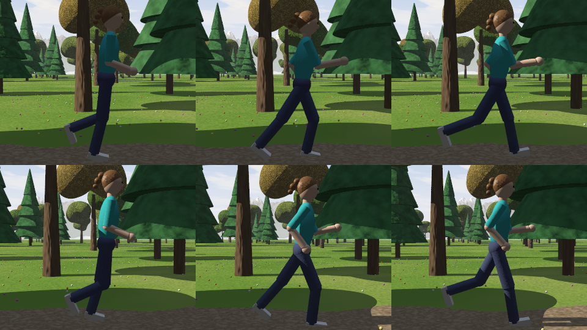
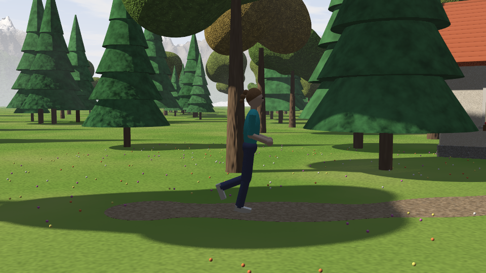
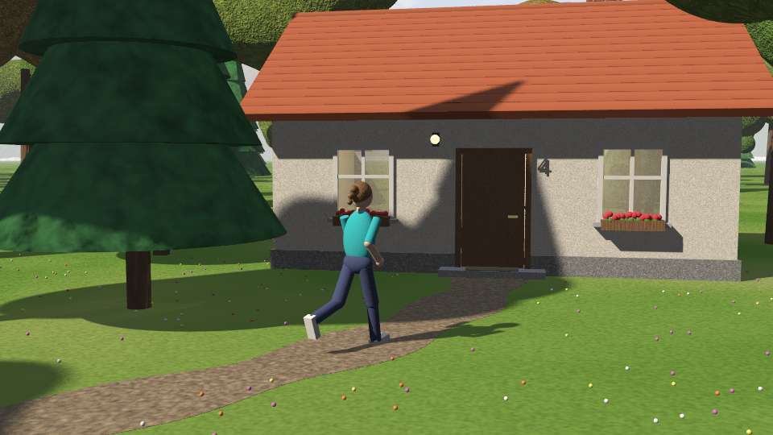
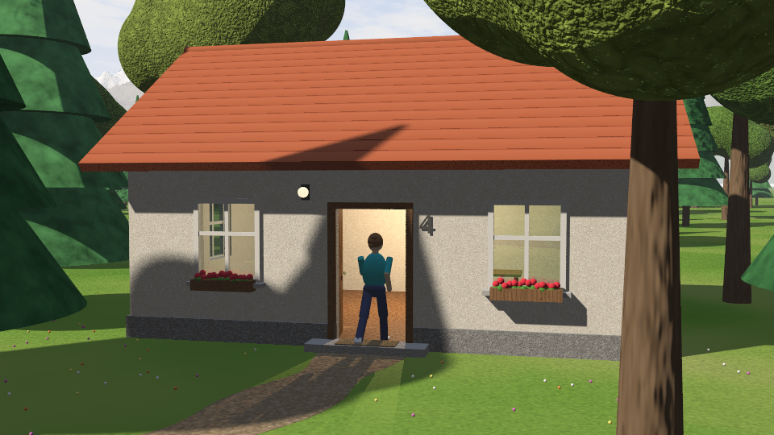
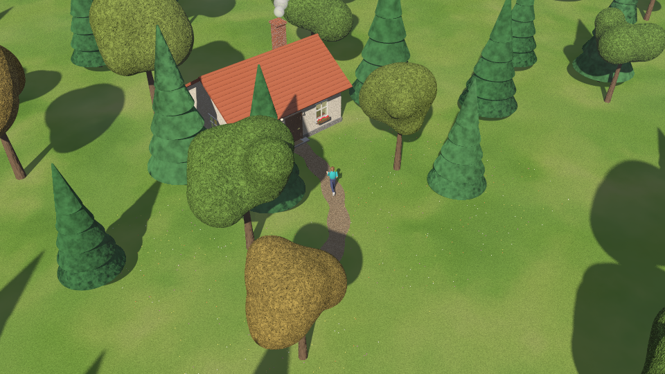

# Programmiertagebuch: POV-Ray-Animation „Feierabend“

**Datei:** `movement.pov`
**Datum:** 24.09.2026
**Werkzeug:** POV-Ray 3.7

---

## Aufgabenstellung

> Ein mit `merge` kombiniertes Männchen bewegt sich genau 4 Sekunden lang sichtbar durch eine Landschaft, die Bäume enthält. Am Ende betritt sie ein Haus mit Dach oder einen Turm mit Dach. Eine Lichtquelle ist am Himmel platziert, so dass sich Schatten bilden.

### Checkliste: Wo steht was im Code?

| Anforderung | Umsetzung | Abschnitt im Code |
|---|---|---|
| Männchen mit `merge` | Körper, Beine, Arme und Kopf sind verschachtelte `merge`-Objekte | `DAS MAENNCHEN` |
| genau 4 Sekunden | `Sekunden = clock * 4`, 100 Bilder bei 25 fps = 4,0 s | `ZEIT`, `quickres.ini` |
| sichtbar in Bewegung | läuft von 0 s bis 4 s auf einem Spline-Weg, die Kamera fährt mit | `DER WEG DES MAENNCHENS`, `KAMERA` |
| Landschaft mit Bäumen | Wiese, Trampelpfad, 9 Bäume von Hand am Weg und ca. 200 zufällig verteilte Bäume | `BAEUME` |
| betritt am Ende ein Haus mit Dach | Tür geht bei 2,3–3,2 s auf, bei 4,0 s steht sie in der Tür | `DAS HAUS` |
| Lichtquelle am Himmel mit Schatten | Sonne bei `<-4000, 4300, -3200>` (ca. 40° hoch), dazu weiche Schatten | `LICHT` |
| ausführlich kommentiert | jeder Abschnitt und fast jede Zeile hat einen Kommentar | ganze Datei |

---

## Eintrag 1: Planung

**Was ich gemacht habe:**
Ich habe die Aufgabe gelesen und mir überlegt, was genau verlangt ist. Das Schwierigste daran sind die „genau 4 Sekunden“. POV-Ray kennt keine Sekunden, sondern nur `clock`, das von 0 bis 1 läuft. Wie lang die Animation wird, hängt nur davon ab, wie viele Bilder man rendert und mit wie vielen Bildern pro Sekunde man sie abspielt.

**Rechnung:**
- 25 Bilder pro Sekunde (fps) × 4 Sekunden = **100 Bilder**
- In der Szene rechne ich `clock` in Sekunden um: `#declare Sekunden = clock * 4;`
- Dann kann ich alles in echten Sekunden planen, zum Beispiel „die Tür geht bei 2,3 s auf“.

**Idee für die Geschichte:**
Eine Frau joggt nach Feierabend über einen Trampelpfad durch eine Wiese mit Bäumen nach Hause. Kurz bevor sie ankommt, geht die Tür auf, weil drinnen schon jemand wartet und Licht an ist. Bei genau 4,0 s steht sie in der Tür.

**Skizze (von oben):**
```
          z
          ^
   17 +---+--------+       <- Haus (8 m x 6 m)
      |   Haus     |
   11 +---[Tür]----+
            |
            |  Pfad (Spline)
           /
          /     Bäume links und rechts
   1.6  (Start)
                           Kamera fährt von vorne links mit
```

---

## Eintrag 2: Grundgerüst aus der Vorlage

**Was ich gemacht habe:**
- Aus der Vorlage `movement_original.pov` habe ich den Aufbau übernommen: `global_settings`, `#include`s, Kamera, Licht, Horizont und Boden.
- Ganz oben habe ich **Schalter** eingebaut (`Weiche_Schatten`, `Kamera_Wahl`, `Baum_Anzahl`). Damit kann ich schnelle Testbilder ohne weiche Schatten machen und die Abgabe dann in voller Qualität rendern.
- Die Schalter stehen in `#ifndef`, deshalb kann man sie auch aus der ini-Datei setzen (`Declare=Weiche_Schatten=0`).
- Ich habe eine Funktion `Weich(Wert, A, B)` geschrieben. Sie gibt einen weichen Übergang von 0 nach 1 zurück (smoothstep). Die brauche ich später für die Tür und die Kamera, damit nichts ruckartig anfängt oder aufhört.

**Gelernt:**
`select(a, b, c)` ist das „if“ innerhalb von Funktionen: Wenn `a < 0` ist, kommt `b` heraus, sonst `c`.

---

## Eintrag 3: Landschaft

**Was ich gemacht habe:**
- **Himmel:** `sky_sphere` mit Farbverlauf, am Horizont warm und hell, oben dunkelblau.
- **Wolken:** Die bozo-Ebene aus der Vorlage habe ich übernommen, aber mit `rgbt` (Transparenz), damit man den blauen Himmel zwischen den Wolken sieht. Die Wolken ziehen mit der Zeit langsam weiter.
- **Dunst:** `fog_type 2` (Bodennebel), sehr dünn. Dadurch werden weit entfernte Sachen blasser, und die Landschaft wirkt tiefer.
- **Wiese:** Zwei Muster übereinander: große Farbflecken (`bozo`) und kleine Beulen (`bumps`).
- **Berge:** `height_field` mit einer Funktion statt eines Bildes. `f_ridged_mf` erzeugt scharfe Grate, und eine Ring-Funktion sorgt dafür, dass die Berge nur außen herum stehen.
- **Trampelpfad:** In einer `#while`-Schleife werden ganz viele flache Zylinder entlang des Weg-Splines gelegt.

**Probleme:**
1. **Flackern am Boden:** Der flache Teil des height_field lag genau auf y = 0, also auf der gleichen Höhe wie die Wiese. POV-Ray weiß dann nicht, welche Fläche vorne ist, und es flackert. Das nennt man *coincident surfaces*.
   **Lösung:** Die Berge 2 m nach unten schieben (`translate <0,-2,0>`). Aus demselben Grund liegt der Pfad 3 mm über dem Gras.
2. **Parse Error bei meiner Testvariable `v`:** `Expected 'undeclared identifier', v found`. `v` ist in POV-Ray schon reserviert, genau wie `x`, `y`, `z`, `t` und `u`.
   **Lösung:** Variablen nie mit einem einzelnen Buchstaben benennen.

---

## Eintrag 4: Bäume

**Was ich gemacht habe:**
- In der Vorlage bestand mein Baum aus 3 Kegeln. Jetzt gibt es ein **Makro `Tanne`** mit Stamm und 5 Kegeln, die immer kleiner werden und höher sitzen. Jede Stufe ist etwas verdreht, damit das Muster nicht gleich aussieht.
- Ein zweites **Makro `Laubbaum`** hat eine Krone aus einem `blob`, also aus 9 Kugeln, die zu einer weichen Form verschmelzen.
- Von jeder Sorte baue ich nur ein paar Varianten und kopiere sie dann. Das ist beim Parsen viel schneller, als jeden Baum neu zu bauen.
- 9 Bäume stehen von Hand direkt am Pfad, damit sie wirklich „zwischen Bäumen durch“ läuft.
- Der Rest wird mit `rand()` zufällig verteilt. Weil der Startwert (`seed(2026)`) fest ist, entsteht in jedem Bild **derselbe** Wald. Mit einem anderen Startwert pro Bild würden die Bäume bei jedem Bild woanders stehen.
- Es gibt eine **Freizone** um Pfad, Haus und Kamera. Bäume, die dort landen würden, werden übersprungen.

**Problem:**
Parse Error in der Zeile mit dem Kegel: Ich hatte `(1 - Stufe * 0.16>` geschrieben, also `>` statt `)`.
**Lösung:** Die Fehlermeldung zeigt die Zeilennummer an, dort war der Tippfehler schnell gefunden.

---

## Eintrag 5: Das Haus

**Was ich gemacht habe:**
- **Wände:** Von einem großen Kasten wird mit `difference` ein kleinerer Kasten innen abgezogen, so wird das Haus hohl. Danach werden Tür und Fenster herausgeschnitten, ebenfalls mit `difference`.
- **Dach:** Die Giebeldreiecke sind ein `prism` und die Dachflächen zwei flache Kästen, die schräg gekippt sind.
  Den Neigungswinkel habe ich ausgerechnet: 2 m Höhe auf 3 m Breite, also `atan2(2, 3)`, das sind ca. 33,7°.
  Die Ziegelreihen macht ein `gradient z`. Weil die Textur **vor** dem Kippen auf den Kasten kommt, kippen die Ziegel mit.
- **Tür:** Sie ist an der linken Angel aufgehängt und geht nach innen auf.
- **Details:** Fenster mit Fensterkreuz und Fensterbank, Blumenkästen mit Geranien, Türrahmen, Stufe, Fußmatte, Lampe, ein Schornstein mit Ziegelmuster (`brick`), ein Tisch drinnen und die Hausnummer **„4“** (wegen der 4 Sekunden).

**Worauf man achten muss:**
`rotate` dreht immer um den **Ursprung** `<0,0,0>`. Würde man die Tür gleich am Haus bauen und dann drehen, würde sie sich um die Mitte der Szene drehen und nicht um ihre Angel.
**Deshalb:** Die Tür so bauen, dass die Angel im Ursprung liegt, dann drehen und erst **danach** mit `translate` an die richtige Stelle schieben. Den gleichen Trick habe ich für alle Gelenke vom Männchen benutzt.

---

## Eintrag 6: Das Männchen (mit merge)

**Was ich gemacht habe:**
Die Figur ist ca. 1,75 m groß, steht mit den Füßen bei y = 0 und schaut nach +z.

| Körperteil | Objekt |
|---|---|
| Kopf | Kugel, leicht in die Länge gezogen |
| Haare | gleiche Kugel, etwas nach hinten oben verschoben, dazu ein Pferdeschwanz aus 3 Kugeln |
| Augen, Nase | kleine Kugeln |
| Oberkörper, Becken | gestauchte Kugeln (Ellipsoide) |
| Arme | Oberarm und Unterarm als Zylinder, Ellenbogen und Hand als Kugeln |
| Beine | Oberschenkel und Unterschenkel als Zylinder, Knie als Kugel, Schuh als Box |

**Warum merge und nicht union?**
Bei `union` werden die Teile nur zusammengefasst, die Flächen im Inneren bleiben erhalten. Bei `merge` werden die Teile zu einem Körper verschmolzen, und die Flächen, wo sich zwei Teile überschneiden, fallen weg. Bei undurchsichtigen Objekten sieht man keinen Unterschied. Macht man die Figur aber durchsichtig, sieht man bei `union` alle Überschneidungen und bei `merge` nicht. Die Aufgabe verlangt `merge`, deshalb ist jedes Teil der Figur ein `merge`, auch die Gelenke innen.

**Aufbau mit Gelenken:**
- Makro `Bein(Huefte, Knie)`: Der Unterschenkel ist ein eigenes `merge`. Es wird am Knie gedreht und dann nach unten geschoben. Danach dreht sich das ganze Bein an der Hüfte.
- Makro `Arm(Schulter, Ellenbogen)` funktioniert genauso.
- Alles zusammen steckt im Makro `Maennchen(Phase)`, einem `merge`, das die Beine, Arme und Kopf-`merge`s enthält.

---

## Eintrag 7: Bewegung

**Was ich gemacht habe:**

**1. Der Weg als Spline**
Ich gebe für bestimmte Zeitpunkte (in Sekunden) einen Punkt vor, und POV-Ray rechnet eine glatte Kurve dazwischen:
```
#declare Weg = spline { natural_spline
    0.0, <-5.20, 0, 1.60>   // Start
    ...
    4.0, < 0.00, 0, 11.15>  // in der Tür
}
#declare Figur_Pos = Weg(Sekunden);
```
**Problem 1:** Wenn die Abstände zwischen den Punkten unterschiedlich groß sind, läuft sie mal schneller und mal langsamer.
**Lösung:** Ich habe eine Kurve geplant und die Punkte darauf so ausgerechnet, dass pro halbe Sekunde immer gleich viel Strecke liegt.

**Problem 2:** Mein erster Weg war 14,7 m lang. In 4 s wären das 3,7 m/s gewesen, also schon richtiges Rennen.
**Lösung:** Den Startpunkt näher ans Haus gelegt. Jetzt sind es 11,5 m in 4 s, also 2,9 m/s, lockeres Joggen (ca. 1,43 m pro halbe Sekunde).

**2. Laufrichtung**
Ich nehme einen Punkt kurz vor und einen kurz nach der aktuellen Position auf dem Weg. Die Differenz ist die Laufrichtung, und `atan2(dx, dz)` gibt den Drehwinkel um die y-Achse.

**3. Laufzyklus**
- `Phase` ist ein Winkel, der mit der gelaufenen Strecke wächst (1 m pro Schritt).
- Die Beine schwingen mit `sin(Phase)`, das linke und das rechte sind um 180° versetzt.
- Die Arme schwingen gegengleich, wie beim echten Laufen.
- Das Knie beugt sich stark, wenn das Bein nach vorne schwingt, und ist fast gerade, wenn das Bein hinten auf dem Boden ist.
- Der Pferdeschwanz wippt doppelt so schnell wie die Schritte.

**4. Wippen**
Wenn ein Bein schräg steht, ist die Hüfte tiefer. Die Figur wird genau um `0,92 · (cos(Winkel) − 1)` abgesenkt, damit die Füße nicht in der Luft hängen. Dazu kommt ein kleiner Hüpfer, weil man beim Joggen kurz „fliegt“.

**5. Kontrolle**
Mit der Nahaufnahme-Kamera (`Kamera_Wahl = 3`) habe ich mehrere Bilder hintereinander gerendert und geprüft, ob Arme und Beine richtig schwingen:



---

## Eintrag 8: Kamera, Licht und Feinschliff

**Kamera:**
Die Kamera fährt langsam mit und schwenkt dabei vom Männchen immer mehr zum Haus. Am Anfang schaut sie nur auf die Figur, am Ende auf eine Mischung aus Figur und Haus, damit das Dach mit im Bild ist. Die Übergänge laufen über meine `Weich()`-Funktion, deshalb ruckelt nichts.

**Licht:**
- **Sonne** am Himmel bei `<-4000, 4300, -3200>`, also weit weg, links hinter der Kamera und ca. 40° hoch. Dadurch wirft alles schräge Schatten nach rechts hinten.
  Warmes Licht, weil später Nachmittag ist. Mit `area_light` werden die Schattenkanten weich wie bei echter Sonne.
- **Himmelslicht:** ein schwaches, blaues Licht ohne Schatten (`shadowless`). Dadurch sind die Schatten nicht schwarz, sondern leicht blau, wie draußen in echt.
- **Licht im Haus:** eine warme Lampe mit `fade_distance`, die man durch die Fenster und die offene Tür sieht.

**Animierte Details:**
- Die Tür geht zwischen 2,3 s und 3,2 s auf, also bevor sie ankommt.
- Aus dem Schornstein steigt Rauch: 8 Wolken, jede mit eigenem „Alter“, die mit `mod()` immer wieder von vorne anfangen.
- Die Wolken am Himmel ziehen weiter.

**Problem:**
Die Blumen auf der Wiese waren zu groß und sahen aus wie bunte Bonbons.
**Lösung:** Radius von 3,5 cm auf 1,8 cm und weniger Blumen.

---

## Eintrag 9: Rendern und Abgabe

**Einstellungen** (in `quickres.ini` unter „Movement 1920x1080, 100 Bilder“):
- Auflösung 1920 × 1080, Antialiasing 0.3
- `Initial_Frame=1`, `Final_Frame=100`
- `Initial_Clock=0`, `Final_Clock=1`
- Abspielen mit **25 fps**, das ergibt **genau 4,0 Sekunden**

**Renderzeit:** ca. 10–20 Sekunden pro Bild, also etwa 20–30 Minuten für alle 100 Bilder.

**Video zusammenfügen:**
```
ffmpeg -framerate 25 -i movement%03d.png -c:v libx264 -pix_fmt yuv420p movement.mp4
```

### Ergebnis

| 0 s: Start | 2 s: Mitte | 4 s: Ende (sie betritt das Haus) |
|---|---|---|
|  |  |  |

Übersicht von oben (Kamera 2): Man sieht den Pfad zwischen den Bäumen, das Haus und die Schatten.



---

## Fazit

**Was gut geklappt hat:**
- Weil alles nur von einer einzigen Zeitvariable (`Sekunden`) abhängt, konnte ich die Animation sehr genau planen: Die Tür geht bei 2,3 s auf, und bei 4,0 s ist sie im Haus.
- Der Trick „Gelenk in den Ursprung, drehen, dann verschieben“ hat bei der Tür, den Beinen und den Armen funktioniert.
- `#while`-Schleifen und Makros sparen extrem viel Tipparbeit. In der Vorlage habe ich noch 34 Bäume per Hand kopiert.

**Was schwierig war:**
- Den Laufzyklus so hinzubekommen, dass er natürlich aussieht (Knie, Arme, Wippen). Dafür habe ich viele Testbilder mit der Seitenkamera gebraucht.
- Die Figur gleichmäßig schnell laufen zu lassen, das ging nur mit ausgerechneten Spline-Punkten.

**Was ich noch verbessern würde:**
- Hände mit Fingern und ein Gesicht mit Mund.
- Grashalme statt nur einer Textur. Das würde aber die Renderzeit stark erhöhen.
